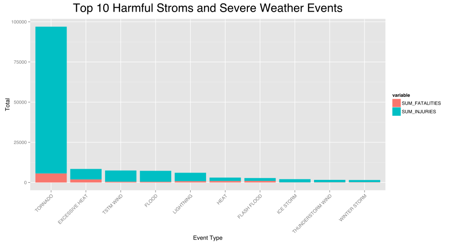
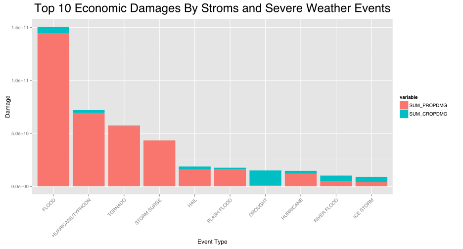

# Most hamful stroms and other weathers in the U.S from 1950 - 2011

#### Jaehyun Shin, 19. Dec. 2014, Reproduciabl Research Course Projec
======

## Synopsis
The aim of this report is to analyze top harmful storms and severe weather events in the U.S between the years 1950 and 2011. 

Storms and other severe weather events can cause both public health and economic problems for communities and municipalities. Many severe events can result in fatalities, injuries, and property damage, and preventing such outcomes to the extent possible is a key concern.

Source of this project is from the U.S. National Oceanic and Atmospheric Administration's (NOAA) storm database. This database tracks characteristics of major storms and weather events in the United States, including when and where they occur, as well as estimates of any fatalities, injuries, properties, crops damage.

## Data Processing
======
### prepare libraries and data  
* [Storm Data](https://d396qusza40orc.cloudfront.net/repdata%2Fdata%2FStormData.csv.bz2)
* [Storm Data Document](https://d396qusza40orc.cloudfront.net/repdata%2Fpeer2_doc%2Fpd01016005curr.pdf)
* [Strom Data FAQ](https://d396qusza40orc.cloudfront.net/repdata%2Fpeer2_doc%2FNCDC%20Storm%20Events-FAQ%20Page.pdf)

```r
library(data.table)
library(dplyr)
library(ggplot2)

# Assum Strom Data in current local path
data = data.table(read.csv(bzfile('repdata-data-StormData.csv.bz2')))
```

### Processing

```r
# Make padding data by EXP data
calcPadding = function(EXP){
    ifelse(grepl('^\\d$', EXP), (as.numeric(EXP) * 10),
	ifelse(grepl('^[H|h]$', EXP), 100,
	ifelse(grepl('^[K|k]$', EXP), 1000,
	ifelse(grepl('^[M|m]$', EXP), 1000000,
	ifelse(grepl('^[B|b]$', EXP), 1000000000,
	0)))))
}

pData = select(data, EVTYPE, FATALITIES, INJURIES)
pData = mutate(data, EVTYPE = as.factor(EVTYPE))
eData = select(data, EVTYPE, PROPDMG, PROPDMGEXP, CROPDMG, CROPDMGEXP)
eData = mutate(eData, EVTYPE = as.factor(EVTYPE), PROPDMG =  PROPDMG * calcPadding(PROPDMGEXP), CROPDMG = CROPDMG * calcPadding(CROPDMGEXP))
```

#### Processing about population health

```r
pResult = group_by(pData, EVTYPE) %>%
	summarise(SUM_FATALITIES = sum(FATALITIES), SUM_INJURIES = sum(INJURIES)) %>%
	arrange(desc(SUM_FATALITIES + SUM_INJURIES)) %>%
	slice(1:10) %>%
	mutate(EVTYPE = factor(EVTYPE, levels = EVTYPE))
```

#### Processing about economic consequences

```r
eResult = group_by(eData, EVTYPE) %>%
	summarise(SUM_PROPDMG = sum(PROPDMG), SUM_CROPDMG = sum(CROPDMG)) %>%
	arrange(desc(SUM_PROPDMG + SUM_CROPDMG)) %>%
	slice(1:10) %>%
	mutate(EVTYPE = factor(EVTYPE, levels = EVTYPE))
```
  
## Results
======
### Most harmful with respect to population health

#### Table

```r
pResult
```

```
##               EVTYPE SUM_FATALITIES SUM_INJURIES
## 1            TORNADO           5633        91346
## 2     EXCESSIVE HEAT           1903         6525
## 3          TSTM WIND            504         6957
## 4              FLOOD            470         6789
## 5          LIGHTNING            816         5230
## 6               HEAT            937         2100
## 7        FLASH FLOOD            978         1777
## 8          ICE STORM             89         1975
## 9  THUNDERSTORM WIND            133         1488
## 10      WINTER STORM            206         1321
```

#### Plots

```r
pMelt = melt(pResult, id.vars= 'EVTYPE')
p1 = ggplot(pMelt, aes(x = EVTYPE, y = value, fill = variable))
p1 = p1 + geom_bar(stat = 'identity')
p1 = p1 + xlab('Event Type') + ylab('Total') + theme(axis.text.x = element_text(angle = 45, hjust = 1))
p1 = p1 + ggtitle('Top 10 Harmful Stroms and Severe Weather Events')
p1 = p1 + theme(plot.title = element_text(vjust=2, size=rel(2)))
p1
```

 

### Events have the greatest economic consequences

#### Table

```r
eResult
```

```
##               EVTYPE  SUM_PROPDMG SUM_CROPDMG
## 1              FLOOD 144657709800  5661968450
## 2  HURRICANE/TYPHOON  69305840000  2607872800
## 3            TORNADO  56937177375   414957910
## 4        STORM SURGE  43323536000        5000
## 5               HAIL  15732282005  3025955050
## 6        FLASH FLOOD  16140834783  1421317100
## 7            DROUGHT   1046106000 13972566000
## 8          HURRICANE  11868319010  2741910000
## 9        RIVER FLOOD   5118945500  5029459000
## 10         ICE STORM   3944930310  5022113500
```

#### Plots


```r
eMelt = melt(eResult, id.vars = 'EVTYPE')
p2 = ggplot(eMelt, aes(x = EVTYPE, y = value, fill = variable))
p2 = p2 +  geom_bar(stat = 'identity')
p2 = p2 + xlab('Event Type') + ylab('Damage') + theme(axis.text.x = element_text(angle = 45, hjust = 1))
p2 = p2 + ggtitle('Top 10 Economic Damages By Stroms and Severe Weather Events')
p2 = p2 + theme(plot.title = element_text(vjust=2, size=rel(2)))
p2
```

 

## Conclusion
======
From my reseach, I conclude that tornado is most harmful to Fatalities and Injuries and flood occure greatest damage to properties and drought occure greatest damage to crops
